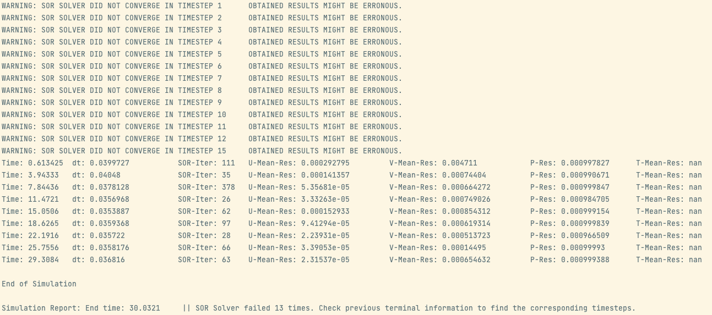

**FLUIDchem** is a CFD solver that can be used to model single-phase chemical reactions of type A + B -> C.
There are various features, including but not limited to:

* Arbitrary order reaction kinetics
* Exo- and endothermic reactions
* Temperature dependent reaction-rate-constant calculation
* Supporting parallel execution
* User defined mesh refinement 
* ...

It was developed at TUM by Theresa Hefele, Virag Vörös and Elia Zonta in the CFD Lab course of SoSe 2021.

## Software Requirements

* VTK 7 or higher
* GCC 9 (optional) / Clang
* MPI
  
Detailed information is given below.

## Installing

```shell
git clone https://gitlab.lrz.de/00000000014A3FA0/fluidchen-skeleton
cd fluidchen-skeleton
mkdir build && cd build
cmake ..
make
make install # optional, check prefix
```

These commands will create the executable `fluidchem` and copy it to the default directory `/usr/local/bin` . If you want to install to a custom path, execute the cmake command as

```shell
cmake -DCMAKE_INSTALL_PREFIX=/path/to/directory ..
```

After `make && make install` **FLUIDchem** will be installed to `/path/to/directory/bin` . Note that you may need to update your `PATH` environment variable.

By default, **FLUIDchem** is installed in `DEBUG` mode. To obtain full performance, you can execute cmake as

```shell
cmake -DCMAKE_BUILD_TYPE=RELEASE ..
```

or

```shell
cmake -DCMAKE_CXX_FLAGS="-O3" ..
```

## Running

In order to run **FLUIDchem**, the case file should be given as input parameter. Some default case files are located in the `example_cases` directory. If you installed **FLUIDchem**, you can execute them from anywhere you want as

For Serial:

```shell
mpirun -np 1 ./fluidchem /path/to/fluidchem/example_cases/LidDrivenCavity/LidDrivenCavity.dat
```

To calculate the simulation in parallel, run:

```shell
mpirun -np <iproc*jproc> ./fluidchem /path/to/fluidchem/example_cases/LidDrivenCavity/LidDrivenCavity.dat
```

If you want to run on more cores than available on your machine, simply run:
```shell
mpirun --oversubscribe -np <iproc*jproc> ./fluidchem /path/to/fluidchem/example_cases/FluidTrap/FluidTrap.dat
```

, where iproc and jproc represent the number of division in x-, and y-directions. Accordingly, iproc*jproc represents the total amount of processes used to calculate this simulation.
Be aware that these have to match the iproc and jproc parameters in the .dat file. If the user wants to calculate in serial iproc and jproc can either be deleted in the dat file or set to 1.

This will run the case file and create the output folder `/path/to/case/case_name_Output_iprocxjproc` which holds the `.vtk` files of the solution. The output folder is created in the same location as your case file. Note that this may require write permissions in the given directory.

For analysis of the parallel results: Each rank writes it's own .vtk file. Plotting them next to each other resembles the complete simulation in the end. 

If an input file does not contain a geometry file, **FLUIDchem** will run the lid-driven cavity case with given parameters.

### Simulation Report 

Fluidchem is printing important information about the simulation to the terminal at runtime. It will tell the user if the SOR solver is not converging, as well as the pressure residuals and the overall computation time from initialisation to finalisation. 
WATCH OUT: RESIDUALS AND RELATIVE UPDATES ONLY VALID FOR THE MASTER RANK!

#### General Information

* If the SOR solver doesn't converge it will tell you at which timestep it fails
* Relative update of the velocities in x and y directions and temperature (U-Rel-Update, V-Rel-Update, T-Rel-Update), calculated with the following formula:
```cpp
u_rel_update = std::abs(1 - previous_mean_u / _field.u_avg());
v_rel_update = std::abs(1 - previous_mean_v / _field.v_avg());
t_rel_update = std::abs(1 - previous_mean_t / _field.t_avg());
```
* The relative update of the pressure value, calculate in the SOR solver (this one is also used as an exit condition for the SOR-solver)

#### How to interpret the result statistics
If the user expects a steady solution, then the relative updates are a good metric for judging the convergence of the simulation. The lower they are the better and the user can also terminate the simulation once the relative update values are below a desired threshold by using "Ctrl + C".
For unsteady solutions the relative update values will probably decrease at the beginning of the solution and later oscillate.

WARNING: 
* Fluidchem always plots all relative update values. In simulations where there is no temperature calculated, the relative update value for temperature will be nan. 
* In our simulation examples the volume forces are set to zero. That means we will not see velocity developments based on temperature differences. Accordingly the relative update for velocity and pressure as well as the SOR-Iterations can be zero.

This is how the terminal information could look like:



### GCC version

You can get you current version of GCC by running:

```shell
g++ -v
```

#### Defining your GCC version

If you have GCC 9 or newer, you can set in the `CMakeLists.txt` file:

```cmake
set(gpp9 True)
```

If you have a version lower than 9, then you don't have to modify the `CMakeLists.txt` file.

This will affect how we are using the C++ filesystem library, which is available already in GCC 7 as an experimental feature.

### Setup of VTK and GCC 9 (Ubuntu **20.04**)

```shell
apt-get update &&
apt-get upgrade -y &&
apt-get install -y build-essential cmake libvtk7-dev libfmt-dev
```

### Setup of VTK and GCC 9 (Ubuntu **18.04**)

If you want, you can upgrade your compiler version to have access to more recent C++ features.
This is, however, optional.

```shell
apt-get update &&
apt-get install -y software-properties-common &&
add-apt-repository -y ppa:ubuntu-toolchain-r/test &&
apt-get upgrade -y &&
apt-get install -y build-essential cmake libvtk7-dev libfmt-dev gcc-9 g++-9
apt-get install -y gcc-9 g++-9
```

### Setup of VTK and GCC 9 (OSX)

The dependencies can be installed by using `homebrew` package manager as

```shell
brew install gcc
brew install vtk
```

By default, `g++` command is linked to `clang` command in OSX operating systems. In order to use the installed version

```shell
cmake -DCMAKE_CXX_COMPILER=/usr/local/bin/g++-9 ..
```

should be used.

## Using CMake

CMake is a C++ build system generator, which simplifies the building process compared e.g. to a system-specific Makefile. The CMake configuration is defined in the `CMakeList.txt` file.

In order to build your code with CMake, you can follow this (quite common) procedure:

1. Create a build directory: `mkdir build`
2. Get inside it: `cd build`
3. Configure and generate the build system: `cmake ..` (Note the two dots, this means that the `CmakeLists.txt` File is in the folder above)
4. Build your code: `make` (build the executable)

### Troubleshooting: VTK not found

You might run into a problem where the VTK library is not found. To fix this, you can try the following steps:

1. Find the installation path of your VTK library 
2. Define this path as an environment variable, as e.g. `export VTK_DIR=".../lib/cmake/vtk-8.2"`
3. Start in a clean build folder
4. Run `cmake ..` again

### Set a different GCC version

If you have multiple compiler versions installed you can set the GCC version which should be used by `cmake` like this:

```shell
export CXX=`which g++-7`
```

Make sure to use a backtick (\`) to get the `which` command executed. Afterwards, you can run `cmake ..`.

### Setting up a simulation

You will have to provide a .dat file with input parameters and a .pgm file containing information about the geometry to **FLUIDchem**.
To see how this works, please check out the `first-steps.md` in the `firststeps` directory.


