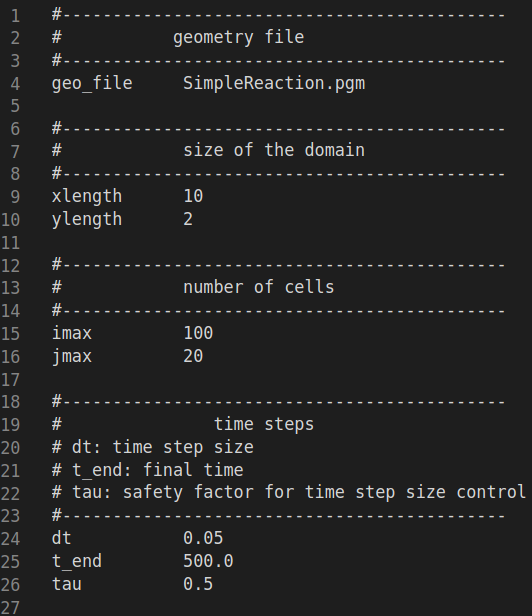
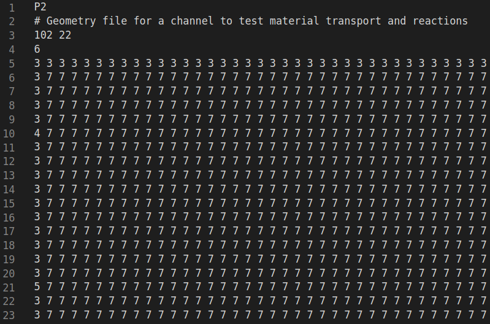

### Setting up a simulation

Before creating a .dat and .pgm file, a directory corresponding to the simulation should first be created.
In this directory the .dat and .pgm file should be saved. The output of the simulation will be stored in this directory as well.

### The .dat file

The .dat file (ideally) contains all the parameters **FLUIDchem** needs to produce results. An example of how this could look would be:

The possible parameters can be seen in the `example.dat`.

### The .pgm file

The .pgm file contains geometric information needed for the simulation. An example of how this could look would be:

Fluidchem needs as an input a .pgm file in the P2 standard, which means text format (ASCII), and the first line of the .pgm file should contain it.
The third line contains the number of values in x and y direction specified by the .pgm file. WATCH OUT: IN THE .DAT FILE imax AND jmax ARE THOSE VALUES -2.
The fouth line contains the number of different cell types.

Legend:
0  Fluid
1  Inflow
2  Outflow
3  Wall/Obstacle
4  Concentration a
5  Concentration b
7  Fluid/Conversion
8  Moving Wall
9  Wall/Obstacle (new/other physical values compared to 3)

If you want to explore Fluidchem checkout our example cases.
